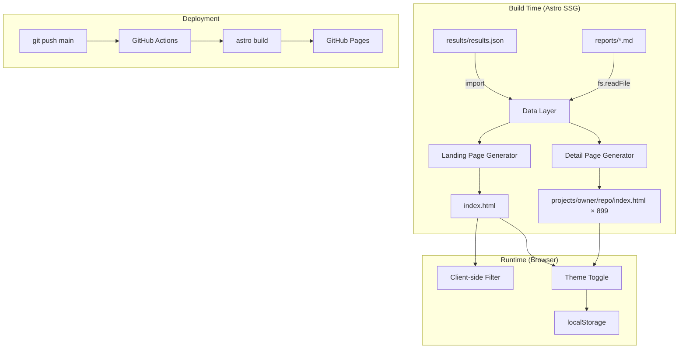

# Design Document: Valkey Analysis Dashboard

## Overview

The Valkey Analysis Dashboard is a static website built with [Astro](https://astro.build/) that presents the output of a multi-phase Valkey integration analysis pipeline. The site reads pre-generated data — a single `results/results.json` file (899 repositories, ~39K lines) and 899 per-repo markdown reports in `reports/` — and produces a fully static set of HTML/CSS/JS pages suitable for GitHub Pages hosting.

The architecture is intentionally simple: Astro's static site generation (SSG) reads the data at build time, produces a landing page with a filterable project list and summary statistics, and generates one detail page per repository. A lightweight client-side theme system supports light, dark, and system color modes with localStorage persistence. Deployment is automated via a GitHub Actions workflow that builds and publishes to GitHub Pages on every push to `main`.

### Key Design Decisions

1. **Astro 6.x SSG over SPA frameworks** — The data is read-only and changes only when the analysis pipeline re-runs. SSG eliminates runtime data fetching, produces fast-loading pages, and simplifies hosting. Astro's built-in markdown rendering handles the report files natively. The project targets **Astro 6.x** (the current stable major version as of May 2026) to ensure we use the latest APIs and avoid older patterns from Astro 4.x/5.x that may have more training data weight.

2. **Client-side filtering over server-side** — With 899 rows, client-side filtering via vanilla JavaScript is fast and avoids the complexity of a search API or build-time permutations.

3. **Vanilla CSS with custom properties over a CSS framework** — The site has a small surface area (two page types, one theme toggle). CSS custom properties provide clean theme switching without adding a framework dependency.

4. **Data loaded via `import` at build time** — Astro supports importing JSON directly. Report markdown files are read via `fs` at build time during static route generation.

5. **Website in `website/` subdirectory** — Keeps the Astro project isolated from the analysis scripts, data files, and Python environment at the workspace root.

## Architecture



### Directory Structure

```
workspace root/
├── results/results.json          # Source data (899 repos)
├── reports/*.md                  # Per-repo markdown reports (899 files)
├── data/*.json                   # Phase-level intermediate data
├── website/                      # Astro project
│   ├── astro.config.mjs
│   ├── package.json
│   ├── tsconfig.json
│   ├── public/
│   │   └── favicon.svg
│   ├── src/
│   │   ├── layouts/
│   │   │   └── BaseLayout.astro  # Shared HTML shell, theme script
│   │   ├── components/
│   │   │   ├── Header.astro      # Site header + theme toggle
│   │   │   ├── SummaryStats.astro # Aggregate statistics cards
│   │   │   ├── ProjectTable.astro # Filterable project list
│   │   │   ├── StatusBadge.astro  # Color-coded support badge
│   │   │   ├── ThemeToggle.astro  # Light/dark/system switcher
│   │   │   └── BackLink.astro    # Navigation back to list
│   │   ├── pages/
│   │   │   ├── index.astro       # Landing page
│   │   │   └── projects/
│   │   │       └── [...slug].astro # Dynamic detail pages
│   │   ├── styles/
│   │   │   └── global.css        # CSS custom properties, theme vars
│   │   ├── lib/
│   │   │   └── data.ts           # Data loading + transformation
│   │   └── types/
│   │       └── index.ts          # TypeScript interfaces
│   └── dist/                     # Build output (gitignored)
├── .github/
│   └── workflows/
│       └── deploy.yml            # GitHub Pages deployment
└── Taskfile.yml                  # Task runner config
```

### Data Flow

1. **Build time**: `src/lib/data.ts` imports `results/results.json` (using a relative path `../../results/results.json`) and exposes typed helper functions: `getAllRepos()`, `getSummary()`, `getMetadata()`, and `getReportContent(owner, repoName)` (which reads the corresponding markdown file from `../../reports/`).

2. **Page generation**: `index.astro` calls `getAllRepos()` and `getSummary()` to render the landing page. `[...slug].astro` uses `getStaticPaths()` to enumerate all 899 repos and calls `getReportContent()` for each, rendering the markdown to HTML via Astro's built-in markdown processor.

3. **Client runtime**: The landing page ships a small inline `<script>` for filtering the project table by Valkey support status. The theme toggle script runs on every page via the base layout.

## Components and Interfaces

### Astro Components

#### `BaseLayout.astro`

The shared HTML shell wrapping every page.

**Props:**

```typescript
interface BaseLayoutProps {
  title: string;        // Page <title>
  description?: string; // Meta description
}
```

**Responsibilities:**

- Renders `<!DOCTYPE html>`, `<head>` (with meta tags, global CSS link, theme-init script), and `<body>`.
- Includes the `<Header>` component.
- Injects an inline script *before* `</head>` that reads `localStorage.getItem('theme')` and sets `document.documentElement.dataset.theme` to prevent flash of incorrect theme (FOIT prevention).
- Slots page content via `<slot />`.

#### `Header.astro`

Site-wide header bar.

**Renders:**

- Site title/logo: "Valkey Analysis Dashboard"
- `<ThemeToggle />` component aligned to the right
- Navigation link to home page

#### `SummaryStats.astro`

Displays aggregate statistics in a card grid.

**Props:**

```typescript
interface SummaryStatsProps {
  summary: ResultsSummary;
}
```

**Renders:**

- Total repositories analyzed
- Explicit Valkey support count
- Implied Valkey support count
- No Valkey support count
- Valkey Glide users count
- RediSearch users count

Each stat is rendered as a card with a label and value. Cards use CSS custom properties for theming.

#### `ProjectTable.astro`

The main project list table with client-side filtering.

**Props:**

```typescript
interface ProjectTableProps {
  repos: RepoEntry[];
}
```

**Renders:**

- A filter bar with buttons/select for Valkey support status: All, Explicit, Implied, None
- An HTML `<table>` with columns: Project, Valkey Support, Valkey Glide, Use Cases
- Each project name is an `<a>` linking to `/projects/{owner}/{repo_name}`
- Valkey support rendered via `<StatusBadge>`
- Valkey Glide rendered as ✓ / ✗
- Use cases rendered as comma-separated text or "—" if empty

**Client-side behavior:**

- An inline `<script>` attaches click handlers to filter buttons
- Filtering toggles `hidden` attribute on `<tr>` elements based on a `data-support` attribute
- No framework needed — vanilla DOM manipulation

#### `StatusBadge.astro`

A small inline badge for Valkey support status.

**Props:**

```typescript
interface StatusBadgeProps {
  status: 'explicit' | 'implied' | 'none';
}
```

**Renders:**

- A `<span>` with class `badge badge--{status}` and the status text capitalized
- CSS classes map to colors: explicit → green, implied → amber, none → gray
- Colors defined as CSS custom properties so they adapt to light/dark themes

#### `ThemeToggle.astro`

A three-state toggle for color mode.

**Renders:**

- Three buttons (or a segmented control): Light ☀️, Dark 🌙, System 💻
- Active state visually indicated
- Inline `<script>` that:
  - Reads current theme from `localStorage`
  - On click: sets `document.documentElement.dataset.theme`, writes to `localStorage`
  - Listens to `prefers-color-scheme` media query changes to update when in system mode

#### `BackLink.astro`

A simple navigation component for detail pages.

**Renders:**

- `← Back to Project List` link pointing to `/`

### Data Layer (`src/lib/data.ts`)

```typescript
import resultsData from '../../results/results.json';
import fs from 'node:fs';
import path from 'node:path';
import { marked } from 'marked';

export function getAllRepos(): RepoEntry[] {
  return resultsData.repos;
}

export function getSummary(): ResultsSummary {
  return resultsData.summary;
}

export function getMetadata(): ResultsMetadata {
  return resultsData.metadata;
}

export function getRepoBySlug(owner: string, repoName: string): RepoEntry | undefined {
  return resultsData.repos.find(
    r => r.owner === owner && r.repo_name === repoName
  );
}

export async function getReportHtml(owner: string, repoName: string): Promise<string> {
  const reportPath = path.resolve(
    process.cwd(), '..', 'reports', `${owner}__${repoName}.md`
  );
  const markdown = fs.readFileSync(reportPath, 'utf-8');
  return marked(markdown);
}
```

### Page Routes

#### `src/pages/index.astro`

- Imports `getAllRepos()` and `getSummary()`
- Renders `<SummaryStats>` and `<ProjectTable>`
- Wrapped in `<BaseLayout title="Valkey Analysis Dashboard">`

#### `src/pages/projects/[...slug].astro`

- Uses `getStaticPaths()` to generate one page per repo:

  ```typescript
  export async function getStaticPaths() {
    const repos = getAllRepos();
    return repos.map(repo => ({
      params: { slug: `${repo.owner}/${repo.repo_name}` },
      props: { repo }
    }));
  }
  ```

- Fetches report HTML via `getReportHtml(repo.owner, repo.repo_name)`
- Renders repo metadata, classification table, and report content
- Includes `<BackLink>`

## Data Models

### TypeScript Interfaces

```typescript
/** Top-level structure of results/results.json */
interface ResultsData {
  metadata: ResultsMetadata;
  summary: ResultsSummary;
  repos: RepoEntry[];
}

interface ResultsMetadata {
  generated_at: string;   // ISO 8601 timestamp
  total_repos: number;
  analysis_version: string;
}

interface ResultsSummary {
  total_repos: number;
  valkey_support: {
    explicit: number;
    implied: number;
    none: number;
  };
  valkey_search_support: {
    explicit: number;
    implied: number;
    none: number;
  };
  valkey_glide_used: number;
  redisearch_usage: number;
  reports_generated: number;
}

interface RepoEntry {
  repo_name: string;
  owner: string;
  github_url: string;
  description: string;
  language: string;
  stars: number;
  valkey_support: 'explicit' | 'implied' | 'none';
  valkey_search_support: 'explicit' | 'implied' | 'none';
  valkey_glide_used: boolean;
  redisearch_usage: boolean;
  integration_details: IntegrationDetails;
  evidence: Evidence;
  evidence_summary: string;
  detail_report: string;       // e.g. "reports/n8n-io__n8n.md"
  analyzed_at: string;         // ISO 8601 timestamp
}

interface IntegrationDetails {
  client_libraries: string[];
  use_cases: string[];
  integration_type: string;    // "native" | "extension" | "none"
  redis_modules_used: string[];
}

interface Evidence {
  dependencies: string[];
  code_references: number;
  doc_mentions: boolean;
  readme_mentions: boolean;
  issues_prs: IssuePr[];
  discussions: unknown[];
  wiki_mentions: boolean;
  community_extensions: CommunityExtension[];
  issues_prs_total: number;
}

interface IssuePr {
  type: 'issue' | 'pr';
  number: number;
  title: string;
  state: string;
  url: string;
  created_at: string;
  updated_at: string;
  labels: string[];
  search_term: string;
}

interface CommunityExtension {
  repo_url: string;
  description: string | null;
  valkey_mentioned: boolean;
  redis_mentioned: boolean;
}
```

### Theme Data Model

Theme state is stored client-side only:

| Storage | Key | Values | Default |
|---------|-----|--------|---------|
| `localStorage` | `theme` | `"light"`, `"dark"`, `"system"` | `"system"` |
| `document.documentElement.dataset.theme` | `theme` | `"light"`, `"dark"` | Resolved from OS preference |

The `data-theme` attribute on `<html>` is always resolved to either `"light"` or `"dark"` (never `"system"`). The localStorage value tracks the user's *choice*, while the DOM attribute tracks the *applied* theme.

### CSS Custom Properties (Theme Variables)

```css
:root,
[data-theme="light"] {
  --color-bg: #ffffff;
  --color-bg-secondary: #f5f5f5;
  --color-text: #1a1a2e;
  --color-text-secondary: #555;
  --color-border: #e0e0e0;
  --color-link: #2563eb;
  --color-badge-explicit: #16a34a;
  --color-badge-explicit-bg: #dcfce7;
  --color-badge-implied: #ca8a04;
  --color-badge-implied-bg: #fef9c3;
  --color-badge-none: #6b7280;
  --color-badge-none-bg: #f3f4f6;
  --color-card-bg: #ffffff;
  --color-card-border: #e5e7eb;
  --color-table-header-bg: #f9fafb;
  --color-table-row-hover: #f3f4f6;
}

[data-theme="dark"] {
  --color-bg: #1a1a2e;
  --color-bg-secondary: #16213e;
  --color-text: #e0e0e0;
  --color-text-secondary: #a0a0a0;
  --color-border: #2a2a4a;
  --color-link: #60a5fa;
  --color-badge-explicit: #4ade80;
  --color-badge-explicit-bg: #14532d;
  --color-badge-implied: #facc15;
  --color-badge-implied-bg: #422006;
  --color-badge-none: #9ca3af;
  --color-badge-none-bg: #374151;
  --color-card-bg: #16213e;
  --color-card-border: #2a2a4a;
  --color-table-header-bg: #1e2a45;
  --color-table-row-hover: #1e2a45;
}
```

## Correctness Properties

*A property is a characteristic or behavior that should hold true across all valid executions of a system — essentially, a formal statement about what the system should do. Properties serve as the bridge between human-readable specifications and machine-verifiable correctness guarantees.*

### Property 1: Data completeness preservation

*For any* valid `ResultsData` object containing N repository entries, `getAllRepos()` SHALL return an array of exactly N entries, and every entry in the source data SHALL be present in the returned array (no entries dropped or duplicated).

**Validates: Requirements 2.1**

### Property 2: Status badge CSS class mapping

*For any* valid `Valkey_Support_Status` value (`"explicit"`, `"implied"`, or `"none"`), the status badge rendering function SHALL produce an output containing a CSS class that includes the status value, ensuring each status maps to a visually distinct indicator.

**Validates: Requirements 2.4, 6.1, 6.2, 6.3**

### Property 3: Use cases formatting

*For any* array of use case strings, `formatUseCases()` SHALL produce a comma-separated string containing every element of the input array. *For any* empty array, it SHALL produce a placeholder indicator (e.g., "—"). The formatted output SHALL contain all and only the input use case values.

**Validates: Requirements 2.5**

### Property 4: URL slug generation

*For any* `RepoEntry` with an `owner` and `repo_name`, the generated detail page URL path SHALL equal `/projects/{owner}/{repo_name}`, and the `getStaticPaths()` function SHALL produce a slug of `{owner}/{repo_name}` for that entry.

**Validates: Requirements 3.1, 3.6**

### Property 5: Support status filtering

*For any* array of `RepoEntry` objects and *any* valid filter value (`"explicit"`, `"implied"`, `"none"`, or `"all"`), the filter function SHALL return only entries whose `valkey_support` field matches the filter value. When the filter is `"all"`, the function SHALL return all entries unchanged. The filtered result SHALL be a subset of the input (no entries invented).

**Validates: Requirements 5.5**

### Property 6: Theme persistence round-trip

*For any* valid theme value (`"light"`, `"dark"`, or `"system"`), storing the value via `setTheme()` and then retrieving it via `getTheme()` SHALL return the original value. The resolved DOM theme attribute SHALL always be either `"light"` or `"dark"` (never `"system"`).

**Validates: Requirements 7.5**

## Error Handling

### Build-Time Errors

| Error Condition | Handling Strategy |
|----------------|-------------------|
| `results/results.json` missing | Astro build fails with a module resolution error. The data layer import will throw at build time, surfacing the missing file path in the build log. |
| `results/results.json` malformed (invalid JSON) | JSON parse error at import time. Astro surfaces the parse error in the build log with file path and line number. |
| Report markdown file missing for a repo | `getReportHtml()` calls `fs.readFileSync` which throws `ENOENT`. The build fails with the missing file path. This is acceptable since every repo in `results.json` should have a corresponding report. |
| Report markdown file contains invalid markdown | `marked` is lenient and will produce HTML output for any input string. Malformed markdown renders as-is rather than causing a build failure. |
| `results.json` has unexpected schema (missing fields) | TypeScript interfaces catch this at development time. At build time, missing fields render as `undefined` in templates. The type definitions serve as documentation of the expected shape. |

### Runtime Errors

| Error Condition | Handling Strategy |
|----------------|-------------------|
| `localStorage` unavailable (private browsing, disabled) | Theme script wraps `localStorage` access in try/catch. Falls back to system mode (reads `prefers-color-scheme` media query). |
| JavaScript disabled | The site is statically rendered — all content is visible without JS. Filtering and theme toggle are progressive enhancements. The default theme is determined by the `prefers-color-scheme` CSS media query (no JS needed for initial theme). |
| Browser doesn't support `prefers-color-scheme` | Falls back to light mode via the CSS cascade (`:root` styles are light by default). |

### Deployment Errors

| Error Condition | Handling Strategy |
|----------------|-------------------|
| Build failure in GitHub Actions | The workflow fails and reports the error in the Actions log. The previous deployment remains live. |
| GitHub Pages not enabled | The `deploy-pages` action fails with a permissions error. The workflow log indicates the issue. |

## Testing Strategy

### Unit Tests (Vitest)

Unit tests verify specific examples, edge cases, and component rendering.

**Data layer tests (`src/lib/data.test.ts`):**

- `getAllRepos()` returns the expected array from test fixture data
- `getSummary()` returns the expected summary object
- `getRepoBySlug()` returns the correct repo for known owner/name pairs
- `getRepoBySlug()` returns `undefined` for non-existent repos
- `formatUseCases()` renders known arrays correctly (e.g., `["time_series", "vector_store"]` → `"time_series, vector_store"`)
- `formatUseCases()` renders empty array as placeholder

**Theme logic tests (`src/lib/theme.test.ts`):**

- Default theme is `"system"` when localStorage is empty
- `setTheme("dark")` writes `"dark"` to localStorage
- `resolveTheme("system")` returns `"dark"` when `prefers-color-scheme: dark` matches
- `resolveTheme("system")` returns `"light"` when `prefers-color-scheme: light` matches
- `resolveTheme("light")` always returns `"light"` regardless of OS preference
- localStorage errors are caught and fall back to system mode

**Filter logic tests (`src/lib/filter.test.ts`):**

- Filtering by `"explicit"` returns only explicit repos
- Filtering by `"all"` returns all repos
- Filtering an empty array returns an empty array

### Property-Based Tests (Vitest + fast-check)

Property-based tests verify universal properties across randomly generated inputs. Each test runs a minimum of 100 iterations.

The project will use [fast-check](https://github.com/dubzzz/fast-check) as the property-based testing library, integrated with Vitest.

**Configuration:**

- Minimum 100 iterations per property test (`{ numRuns: 100 }`)
- Each test tagged with a comment referencing the design property

**Property tests to implement:**

1. **Feature: valkey-analysis-dashboard, Property 1: Data completeness preservation**
   - Generate random arrays of `RepoEntry` objects, wrap in `ResultsData`, verify `getAllRepos()` returns all entries with correct count.

2. **Feature: valkey-analysis-dashboard, Property 2: Status badge CSS class mapping**
   - Generate random valid status values from `["explicit", "implied", "none"]`, verify the badge function output contains the corresponding CSS class.

3. **Feature: valkey-analysis-dashboard, Property 3: Use cases formatting**
   - Generate random arrays of non-empty strings, verify `formatUseCases()` output contains every input string separated by commas. Generate empty arrays, verify placeholder output.

4. **Feature: valkey-analysis-dashboard, Property 4: URL slug generation**
   - Generate random `owner` and `repo_name` strings (alphanumeric + hyphens), verify the generated slug equals `{owner}/{repo_name}`.

5. **Feature: valkey-analysis-dashboard, Property 5: Support status filtering**
   - Generate random arrays of `RepoEntry` with random support statuses, apply each filter value, verify all returned entries match the filter and no matching entries are missing.

6. **Feature: valkey-analysis-dashboard, Property 6: Theme persistence round-trip**
   - Generate random valid theme values from `["light", "dark", "system"]`, verify `setTheme` then `getTheme` returns the original value. Verify `resolveTheme` never returns `"system"`.

### Integration / Smoke Tests

- **Build smoke test**: Run `astro build` and verify the output directory contains `index.html` and the expected number of detail page directories.
- **Taskfile smoke test**: Verify `Taskfile.yml` contains all required task names with `desc` fields and `dir: website` configuration.
- **Deployment config smoke test**: Verify `deploy.yml` triggers on `main` branch push and uses the correct GitHub Pages actions.

### Accessibility Testing

- Manual testing with screen readers for semantic HTML compliance
- Automated contrast checking for badge colors in both light and dark themes against WCAG 2.1 AA requirements
- Note: Full WCAG compliance validation requires manual testing with assistive technologies and expert accessibility review.
